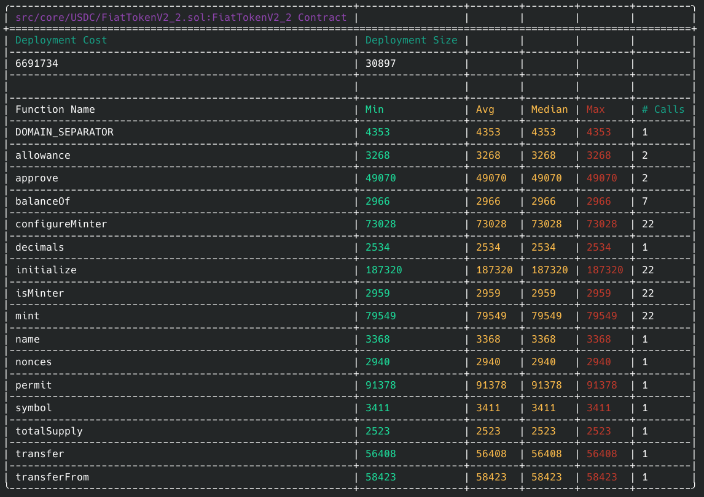
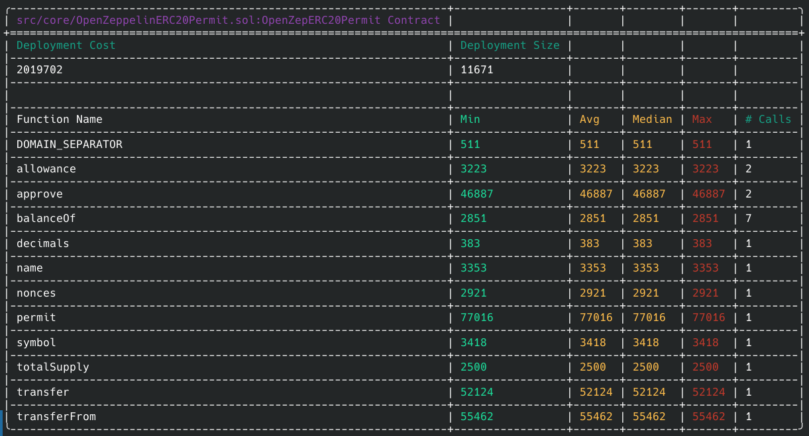
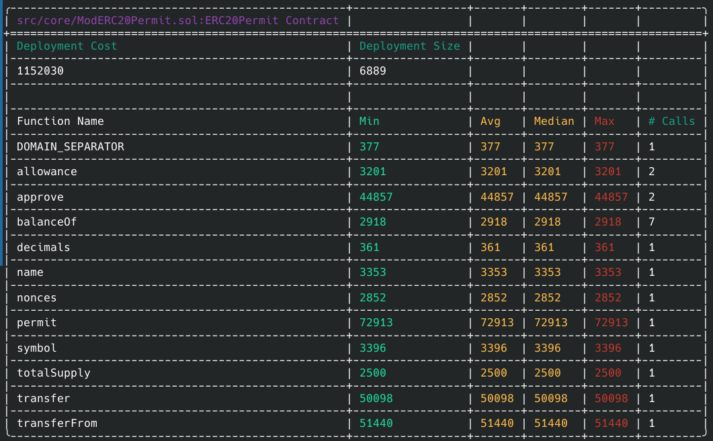

# Introduction

The Gas reports below demonstrate the costs of including additional functionality or bloat in a token contract. 

# Gas Reports

## USDC
	
	{	
		Generate Report: forge test --match-path test/Token/USDC.t.sol --gas-report	
	}

	FiatTokenV2_2:: Aka USDC Contract

	{width="200", height="200"}

## Standard Openzeppelin ERC20 Token

	{	
		Generate Report: forge test --match-path test/Token/StandardToken.t.sol --gas-report 
	}

	{width="200", height="200"}

## Gas Efficient ERC20 Token

	{
		Generate Report: forge test --match-path test/Token/GasEfficientToken.t.sol --gas-report 
	}

	{width="200", height="200"}	
